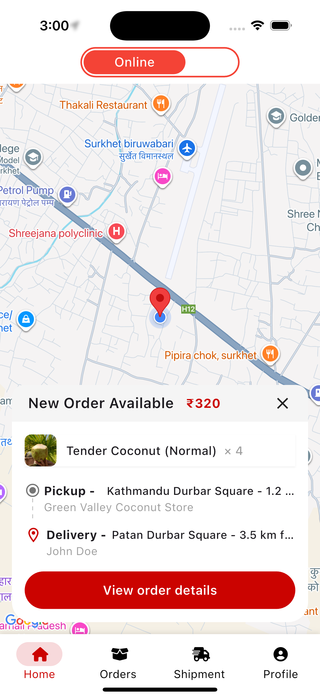
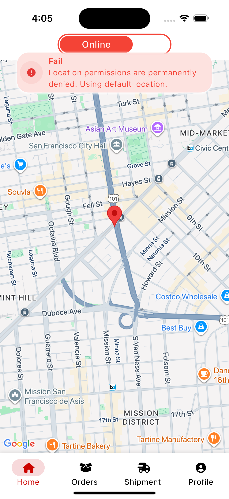
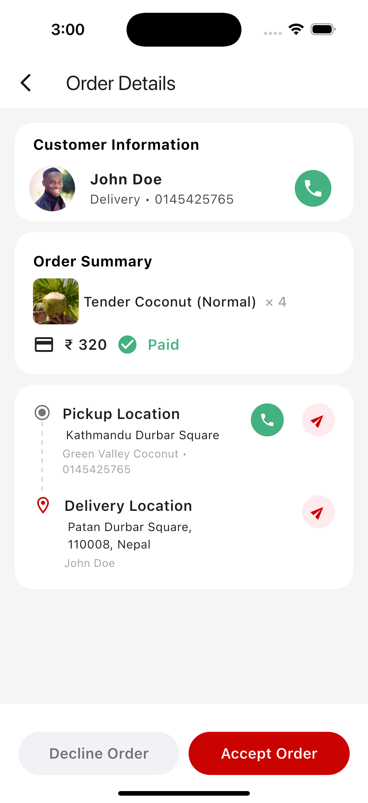
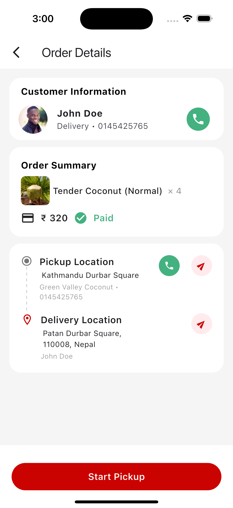
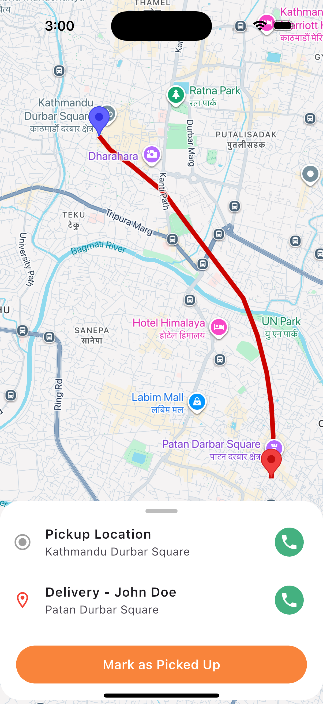
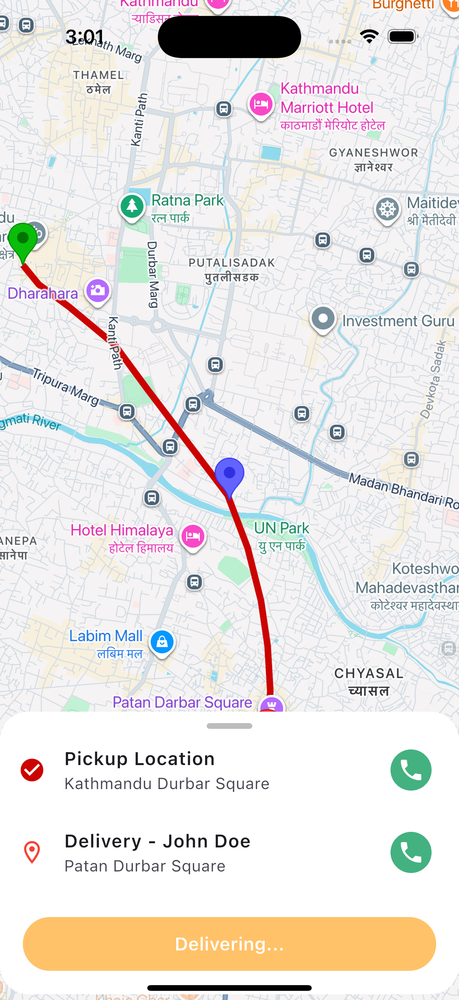
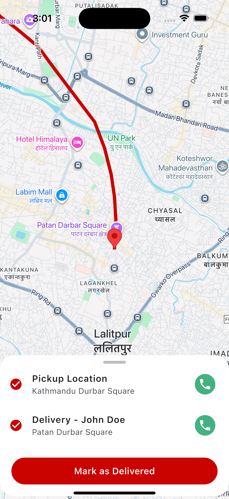
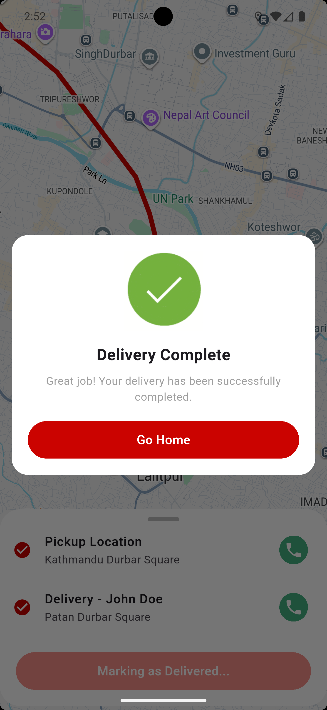

# Delivery Boy Simulation App

A Flutter-based simulation app that demonstrates a delivery boy flow with Google Maps

## Features Implemented

- **Google Maps Setup**
  - Displays a Google Map centered on the current location.
  - Supports zoom and map gestures.

- **Polyline & Route Drawing**
  - Hardcoded pickup and delivery locations.
  - Route drawn using Google Directions API + polyline points.

- **Accept / Reject Order**
  - **Accept** → Shows the route and starts simulating delivery boy movement.
  - **Reject** → Hides the route and displays “Order Rejected”.

- **Movement Simulation**
  - Delivery boy marker smoothly animates along the polyline path.
  - Camera follows the marker during the trip.

- **UI/UX**
  - Clean UI based on provided Figma design.
  - Styled buttons and layout for professional look.

## 🎥 Demo

  
*(Demo of simulation with map, route drawing, and marker movement)*

## Final Look

     

